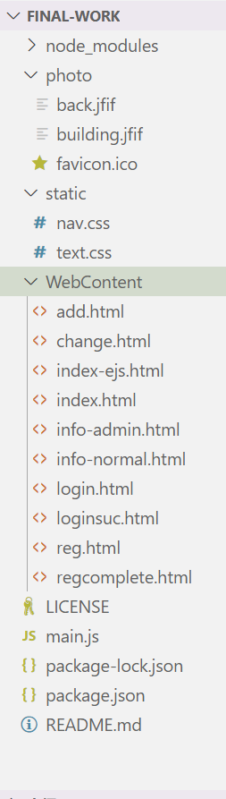

期末作业-社区房屋管理系统

## 一、项目设计
### 1.项目总体构成

项目共有完整页面4个，分别是`index.html`（主页与登录页面），`add.html`（注册页面），`info-normal.html`（普通用户信息管理页面），`info-admin.html`（管理员用户信息管理页面）以及非完整页面`change.html`（普通用户信息修改），`login.html`（登录错误页面），`index-ejs`（使用`ejs`渲染的提示登录页面，该页面是完整页面，但功能重叠），`loginsuc.html`（登录成功提示页）`reg.html`（注册失败`ejs`提示），`regcomplete.html`（注册完成提示页）。

其余静态资源包括背景图片`bacj.jfif`，主界面图片`building.jfif`和图标`favicon.ico`，以及样式文件`nav.css text.css`。后端程序均包含在`main.js`中（函数调用可能存在有关异步的错误）。

### 2.引用包的作用与说明

* 前端库：综述：

  ```html
  <script src="https://code.jquery.com/jquery-3.6.0.min.js"></script>
  <script src="https://cdn.jsdelivr.net/npm/bootstrap@5.1.3/dist/js/bootstrap.bundle.min.js"></script>
  <link href="https://cdn.jsdelivr.net/npm/bootstrap@5.1.3/dist/css/bootstrap.min.css" rel="stylesheet">
   <link rel="stylesheet" href="https://cdn.jsdelivr.net/npm/bootstrap-icons@1.7.2/font/bootstrap-icons.css">
  ```

   - `jquery`：用于在前端便捷地操纵`html`元素，以及使用`ajax`方法部分刷新
   - `bootstrap@5.1.3`：前端页面的样式和框架的前端JavaScript
   - `bootstrap-icons@1.7.2`：前端图标库，用于导航栏。

* 后端库：

  * `express`框架：后端的node.js框架，用于后端路由。
  * `ejs`：后端渲染框架，用于向前端页面渲染部分内容。
  * `path`：用于express框架返回页面的绝对路径定位。
  * `mongoose`：mongo数据库的业务逻辑实现框架。
  * `express-session`：express框架中间件，用于在后端实现session储存当前信息。
  * `body-parser`：express框架中间件，用于分析提取post请求的body以获取前端发送的数据。

### 3.目录结构与部分说明

- node_modules：后端使用的库

  - 略

- photo：存放项目中使用的图片

  - back.jfif
  - building.jfif
  - favicon.ico

- static：静态文件，样式表或脚本（本项目由于函数名和便于调试的问题在制作时脚本直接写在了页面中）

  - nav.css
  - text.css

- WebContent：网页页面

  - add.html
  - change.html
  - index-ejs.html
  - index.html
  - info-admin.html
  - info-normai.html
  - login.html
  - loginsuc.html
  - reg.html
  - regcomplete.html

- LICENSE

- main.js：后端程序

- package.json

- package-lock.json

- README.md

- README中截图

  

## 二、使用说明

### 1.登录

在主页右侧的登录表单内输入自己的账号密码就可以成功登录，会有一个小的欢迎界面替代登录表单。

### 2.登出

单击左侧导航栏最下面的登出按钮，系统会清除登录信息并返回主页。

### 3.注册

单击左侧导航栏的第三项注册或是主页右侧的注册按钮均可进入注册界面，填写信息后即可注册成功，返回主页后需要进行登录。只能注册普通用户账号，管理员权限需要后台管理。

### 4.查看个人信息

普通用户可以通过导航栏第二行查看当前登录账号的个人信息与修改申请。

### 5.修改账号所属的房屋信息

个人信息页面右侧按钮提供了修改功能，单击后会出现选择框和添加删除按钮，分别用于申请添加所选房屋和删除所选房屋。只能添加尚未被申请或拥有的房屋；只能删除本账号已拥有的房屋。

### 6.管理申请

如果登录的是管理员账号，则单击我的信息界面会直接显示目前已收到的申请（一次最多五条，需要刷新页面显示更多），并且提供同意和拒绝按钮，同意将会把信息写入到申请者账号，拒绝则直接删除（驳回）申请。

## 三、开发日记

- 2021/12/11
  - 创建项目
  - 创建README.md
- 2021/12/14
  - 测试将全部内容提交到主分支，避免master与main无法合并的错误
  - 完成了index.html的主体部分
- 2021/12/20
  - 完成了index.html的jquery ajax请求调试
  - 完成了注册页面add.html及附属页面
  - 调整了项目的库依赖
- 2021/12/23
  - 完成了注册功能的post请求和后端响应以及相关数据库操作
  - 调整了自动返回页面的返回时间
- 2021/12/25
  - 完成了登出功能与后端session
  - 确定了最后的申请功能和相关文档的schema
- 2021/12/26
  - 完成了关于用户发送修改请求的功能
  - 调试完成增删改查的操作以及回调，避免了先返回后赋值导致数据错误的问题
- 2021/12/27
  - 完成了管理员的判断和管理员管理页面的业务逻辑
  - 修复了部分跳转找不到页面的问题
- 2021/12/28
  - 对导航栏和部分前端文案进行调整使之美观，修复了页面样式不生效的问题
  - 完整测试业务流程没有问题
- 2021/12/29
  - 文档编写
  - 开源协议同步
  - 对部分未使用的库和重复的功能实现进行优化调整
  - 优化逻辑，房屋所属不再基于用户而还有关于用户姓名，避免了一个账号注册可能会写入同一用户多个账号中的问题

